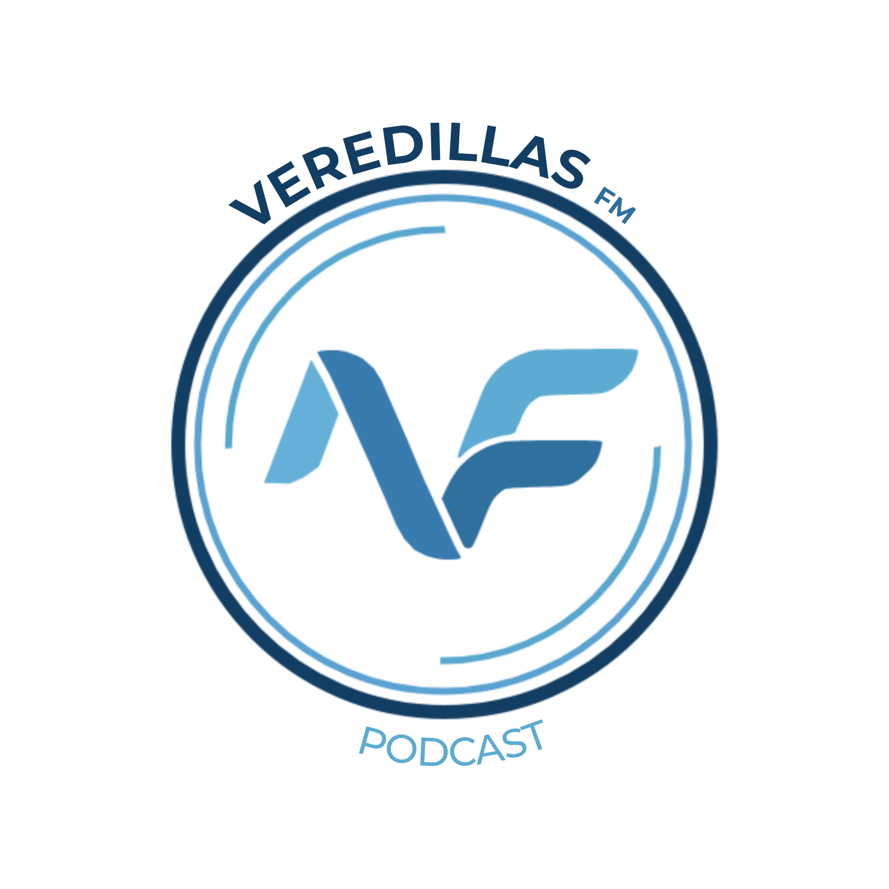

# 🎙️ Veredillas FM

<div align="center">



**El podcast oficial del IES Veredillas**

Una plataforma de radio estudiantil moderna, hecha por alumnos, para alumnos.

[](https://astro.build)
[](https://www.typescriptlang.org/)
[](https://opensource.org/licenses/MIT)
[](http://makeapullrequest.com)

[Ver Demo](https://veredillasfm.es) · [Reportar Bug](https://github.com/Broslunas/veredillas-fm/issues) · [Solicitar Feature](https://github.com/Broslunas/veredillas-fm/issues)

</div>

---

## 📖 Tabla de Contenidos

- [🎯 Sobre el Proyecto](#-sobre-el-proyecto)
- [✨ Características](#-características)
- [🛠️ Tecnologías](#️-tecnologías)
- [🚀 Comenzando](#-comenzando)
- [📂 Estructura del Proyecto](#-estructura-del-proyecto)
- [🎨 Desarrollo](#-desarrollo)
- [📱 PWA](#-pwa)
- [🔍 SEO](#-seo)
- [🤝 Contribuir](#-contribuir)
- [👥 Equipo](#-equipo)
- [📄 Licencia](#-licencia)
- [🙏 Agradecimientos](#-agradecimientos)

---

## 🎯 Sobre el Proyecto

**Veredillas FM** es una plataforma de radio estudiantil moderna desarrollada íntegramente por estudiantes de 2º de Bachillerato B del IES Veredillas. Nuestro objetivo es crear un espacio dinámico y abierto para la libre expresión, donde cada estudiante tenga una voz y cada historia merezca ser contada.

### ¿Qué nos hace especiales?

- 🎓 **Hecho por estudiantes**: Todo el contenido es producido, grabado y editado por alumnos
- 🚀 **Tecnología moderna**: Utilizamos las últimas herramientas web para llevar la radio escolar al siglo XXI
- 🌍 **Sin fronteras**: Transmisión digital que alcanza todo el mundo a través de streaming
- 🎨 **Diseño premium**: Interfaz moderna y atractiva con animaciones fluidas
- 📱 **PWA Ready**: Instalable en móviles como una app nativa

---

## ✨ Características

### 🎧 Contenido
- 📻 **Episodios de Podcast**: Escucha todos nuestros episodios con player integrado de Spotify
- 📝 **Blog Estudiantil**: Noticias, historias y el día a día del instituto
- 🗓️ **Calendario**: Programación de eventos y próximos episodios
- 👥 **Equipo**: Conoce a los creadores detrás del micrófono

### 💫 Experiencia de Usuario
- 🌗 **Modo Oscuro/Claro**: Tema adaptable según preferencias
- 🎵 **Reproductor Persistente**: Player flotante que no se interrumpe al navegar
- ⚡ **SPA Navigation**: Navegación ultra-rápida sin recargas
- 📱 **Responsive**: Diseño adaptado a todos los dispositivos
- ✨ **Animaciones GSAP**: Transiciones suaves y profesionales
- 🎠 **Carruseles Swiper**: Navegación intuitiva de episodios

### 🔧 Características Técnicas
- 🔍 **SEO Optimizado**: OpenGraph, Twitter Cards, Schema.org
- 📊 **Sitemap & RSS**: Indexación automática y feeds
- 🤖 **Robots.txt**: Optimizado para crawlers
- 🍪 **Gestión de Cookies**: Banner de consentimiento GDPR compliant
- 📄 **Páginas Legales**: Política de privacidad, términos, cookies
- 🔐 **TypeScript**: Type-safety en todo el proyecto

---

## 🛠️ Tecnologías

### Core
- **[Astro](https://astro.build)** - Framework web moderno y ultra-rápido
- **[TypeScript](https://www.typescriptlang.org/)** - JavaScript con tipos estáticos

### Estilos & Animaciones
- **CSS Variables** - Sistema de diseño consistente
- **[GSAP](https://greensock.com/gsap/)** - Animaciones profesionales
- **[Swiper](https://swiperjs.com/)** - Carruseles táctiles

### Integraciones
- **[@astrojs/sitemap](https://docs.astro.build/en/guides/integrations-guide/sitemap/)** - Generación de sitemap automático
- **[@astrojs/rss](https://docs.astro.build/en/guides/rss/)** - Feed RSS
- **[Lucide Icons](https://lucide.dev/)** - Iconos SVG modernos

### Content
- **Astro Content Collections** - Sistema de gestión de contenido type-safe
- **Markdown** - Escritura de artículos y episodios
- **Spotify Embed** - Integración de reproductor

---

## 🚀 Comenzando

### Prerequisitos

- **Node.js** v18 o superior
- **npm** v9 o superior

### Instalación

1. **Clona el repositorio**
   ```bash
   git clone https://github.com/Broslunas/veredillas-fm.git
   cd veredillas-fm
   ```

2. **Instala las dependencias**
   ```bash
   npm install
   ```

3. **Inicia el servidor de desarrollo**
   ```bash
   npm run dev
   ```

4. **Abre tu navegador**
   
   Navega a `http://localhost:4321`

### Scripts Disponibles

```bash
npm run dev        # Inicia servidor de desarrollo
npm run build      # Construye para producción
npm run preview    # Previsualiza build de producción
npm run astro      # CLI de Astro
```

---

## 📂 Estructura del Proyecto

```
veredillas-fm/
├── .agent/                    # Documentación y workflows
│   └── SEO-IMPROVEMENTS.md
├── public/                    # Archivos estáticos
│   ├── favicon.ico
│   ├── logo.png
│   ├── robots.txt
│   ├── humans.txt
│   └── manifest.json
├── src/
│   ├── components/           # Componentes reutilizables
│   │   ├── Header.astro
│   │   ├── Footer.astro
│   │   ├── MiniPlayer.astro
│   │   ├── EpisodeCard.astro
│   │   ├── PostCard.astro
│   │   └── ...
│   ├── content/              # Colecciones de contenido
│   │   ├── blog/            # Artículos del blog
│   │   ├── episodios/       # Episodios del podcast
│   │   └── config.ts        # Schemas de validación
│   ├── layouts/             # Layouts de página
│   │   └── Layout.astro
│   ├── pages/               # Rutas del sitio
│   │   ├── index.astro
│   │   ├── about.astro
│   │   ├── blog/
│   │   ├── ep/
│   │   ├── contacto.astro
│   │   ├── calendario.astro
│   │   └── rss.xml.js
│   └── styles/              # Estilos globales
│       └── global.css
├── astro.config.mjs         # Configuración de Astro
├── tsconfig.json            # Configuración de TypeScript
└── package.json             # Dependencias del proyecto
```

---

## 🎨 Desarrollo

### Añadir un Nuevo Episodio

1. Crea un archivo `.md` en `src/content/episodios/`
2. Usa este frontmatter:

```markdown
---
title: "Título del Episodio"
description: "Descripción breve"
pubDate: 2026-01-13
author: "Nombre del Autor"
image: "URL de la imagen"
spotifyUrl: "URL del episodio en Spotify"
season: 1
episode: 1
duration: "45 min"
tags: ["tag1", "tag2"]
---

Contenido del episodio...
```

### Añadir un Artículo al Blog

1. Crea un archivo `.md` en `src/content/blog/`
2. Usa este frontmatter:

```markdown
---
title: "Título del Artículo"
description: "Descripción breve"
pubDate: 2026-01-13
author: "Nombre del Autor"
image: "URL de la imagen"
tags: ["tag1", "tag2"]
---

Contenido del artículo...
```

### Sistema de Temas

El sitio usa CSS variables para un sistema de temas consistente:

```css
:root {
  --color-primary: #8b5cf6;
  --color-secondary: #ec4899;
  --color-background: #0a0a0f;
  /* ... más variables */
}
```

---

## 📱 PWA

El sitio es una **Progressive Web App** (PWA) completamente funcional:

- ✅ Instalable en dispositivos móviles
- ✅ Funciona offline (service worker)
- ✅ Ícono de app personalizado
- ✅ Splash screen
- ✅ Theme color adaptado

El archivo `manifest.json` está configurado para una experiencia nativa.

---

## 🔍 SEO

### Metadatos Implementados

- ✅ **Open Graph** para Facebook, WhatsApp, LinkedIn
- ✅ **Twitter Cards** para previews enriquecidos
- ✅ **Schema.org JSON-LD** para datos estructurados
- ✅ **Canonical URLs** para evitar duplicados
- ✅ **Meta tags completos** en todas las páginas
- ✅ **Sitemap XML** generado automáticamente
- ✅ **RSS Feed** para suscripciones
- ✅ **Robots.txt** optimizado

### Validar SEO

```bash
# Herramientas recomendadas:
# - Google Search Console
# - Facebook Sharing Debugger
# - Twitter Card Validator
# - Google Rich Results Test
```

Ver [SEO-IMPROVEMENTS.md](.agent/SEO-IMPROVEMENTS.md) para más detalles.

---

## 🤝 Contribuir

¡Las contribuciones son lo que hace que la comunidad de código abierto sea un lugar increíble para aprender, inspirar y crear! Cualquier contribución que hagas será **muy apreciada**.

Por favor, lee nuestro [CONTRIBUTING.md](CONTRIBUTING.md) para conocer el proceso de contribución.

### Proceso Rápido

1. Fork el proyecto
2. Crea tu rama de feature (`git checkout -b feature/AmazingFeature`)
3. Commit tus cambios (`git commit -m 'Add: AmazingFeature'`)
4. Push a la rama (`git push origin feature/AmazingFeature`)
5. Abre un Pull Request

---

## 👥 Equipo

### Creadores de Veredillas FM

- **Abel Fernández** - Guionista - [@abelfrp](https://www.instagram.com/abelfrp/)
- **Pablo Luna** - Web, Sonido y Programación - [broslunas.com](https://broslunas.com)
- **Pablo Santamaría** - Diseño Web y Sonido - [@pabl0.sp](https://www.instagram.com/pabl0.sp/)
- **Omar Reyes** - Diseñador Web - [@ereyes_magos](https://www.instagram.com/ereyes_magos/)
- **Dylan Jorge** - Redactor Jefe
- **Pablo Pérez** - Integrante del Podcast - [@__pabloprz](https://www.instagram.com/__pabloprz/)
- **Miguel Salazar** - Estrategia Digital - [@miguelslzzz](https://www.instagram.com/miguelslzzz/)

---

## 📄 Licencia

Este proyecto está bajo la Licencia MIT - ver el archivo [LICENSE](LICENSE) para más detalles.

---

## 🙏 Agradecimientos

- **IES Veredillas** por el apoyo al proyecto
- **Profesorado** por fomentar la creatividad estudiantil
- **Comunidad de Astro** por el increíble framework
- **Todos los oyentes** que hacen posible este proyecto

---

<div align="center">

### 🌟 Si te gusta este proyecto, ¡dale una estrella! ⭐

**Hecho con ❤️ por el equipo de Veredillas FM**

[🎧 Escúchanos](https://veredillasfm.es) · [📧 Contacto](https://veredillasfm.es/contacto) · [📱 Instagram](https://www.instagram.com/veredillasfm.es)

</div>
